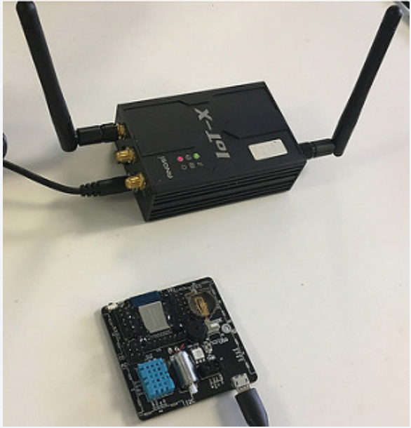
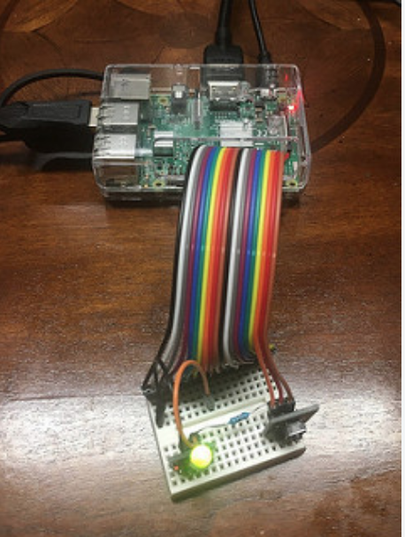
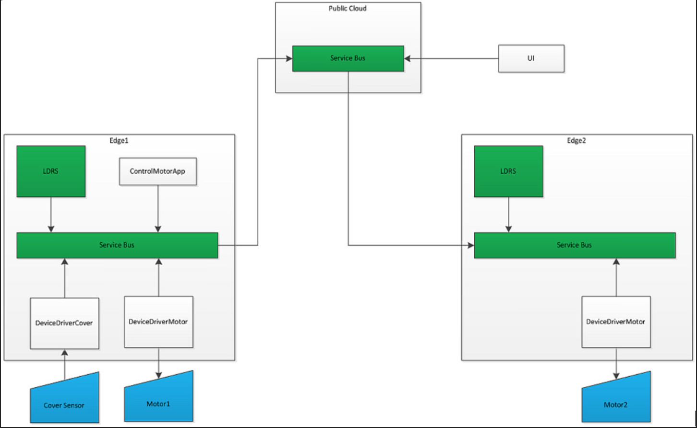

# Edge Cloud V1.0 Developer Manual

## Edge Cloud Service components

### Hardware

1)  Cloud VM (e.g. Linux Ubuntu)

2)  Edge node (e.g. Wrtnode running Mips or Rasp Berry Pi running ARM v7)

3)  Devices (Embedded OS burned by device manufacturer, can only
    communicate with through specific protocol, such as Zigbee)

> Note: the black box with two antennas is the Edge Node named Wrtnode, 
> running Linux Mips OS with 128 MB memory, and only 61 MB left for 
> user apps. The other device is the demo board mount with multiple 
> small devices: 1 infra sensor with red light, 1 motor, 1 temperature/
> humidity detector and 1 push button.

> Note: Raspberry Pi 3 with 1 GB memory which can connect devices 
> directly through GPIO (but it is harder to manage the registration 
> process since sensors are mostly dummy for the Edge Node.

### Software

1)  Center Cloud Service at Public Cloud VM

    -   ETCD as KV store ('etcd' package in golang)
    -   Service Bus ('server' package in golang)
    -   Central Metadata DB Service ('center' package in golang)

2)  Edge Cloud Service (for each Edge Node)

    -   Logical Device Repository Service (LDRS) integrated with  
        Service Bus/lightweight ETCD as libraries ('edge' command in golang)

    -   Application (currently running as independent process, in future will be
        managed by Serverless framework) (golang/nodejs/python)

    -   Device Driver (currently running as independent process, in future will be
        managed by Serverless framework) (golang/nodejs/python)

## Relations of components

## Scenarios

1)  Manage edge local logical devices from cloud

    -   Create logical device for specified edge node (POST)

    -   Read device state (GET)

    -   Update expected device state for target device, and expect the
    linked device takes action (PUT)

2)  Autonomous on edge node

    -   Cover the sensor with finger, the LED is light up. The local
        LDRS states are updated by deviceDriverCover and ControlMotorApp
        and local target Motor1 starts running.

    -   Release the finger from the sensor, the states are reverted back
        to original and the motor should stop running.

3)  Control devices between edge nodes

    -   In 2), if the target device is located inside different edge
        node, the state update is sent to the other edge node through
        the Service Bus, with central cloud's help. Repeat the test
        in 2) will cause the remote motor spins.

## Install/Configure center and edge cloud

> Note: Before all, preparing config.yaml file in the folder where the
> commands were launched. Find the sample config.yaml files from the
> shipped package (git@github.com:/seattle-cloud-lab/EdgeCore.git).

Sample for center:

    serverAddress: "114.115.153.49:10000"
    clusterName: "HuaweiProject1"
    edgeName: "center"
    localTcpPort: 8080
    metaDBService: "114.115.153.49:8080"
    databasePath: "database"
    retryInterval: 100
 
Sample for edge:

    serverAddress: "114.115.153.49:10000"
    clusterName: "HuaweiProject1"
    edgeName: "e1"
    localTcpPort: 8080
    metaDBService: "114.115.153.49:8080"
    databasePath: "database"
    retryInterval: 100
    
> Note: For test run on same node, set the localTcpPort and databasePath differently between center and edge to avoid conflicts.
> You can find respect files here: EdgeCore/configurations/{center | edge}/config.local.yaml, and copy over where the binaries are placed. 
 
Build (under $GOPATH/src folder): 

    - git clone git@github.com:/seattle-cloud-lab/centralmetadatadbservice.git
    - git clone git@github.com:/seattle-cloud-lab/LightweightETCD.git -> github.com/coreos/etcd
    - git clone git@github.com:/seattle-cloud-lab/ServiceBus.git
    - git clone git@github.com:/seattle-cloud-lab/LogicalDeviceRepository -> ldrs
    - git clone git@github.com:/seattle-cloud-lab/syncmeta.git
    
    cd ServiceBus/cmd
    cd centerserver & go build server.go (for central cloud)
    cd centralmetadataservice & go build center.go (for central cloud)
    cd edge & go build edge.go   (for edge node)
	 
	 Note: for compiling 'edge.go', set env correctly first -
	 Wrtnode:
	 		export GOARCH=mipsle
	 		export GOOS=linux
	 Raspberry Pi 3:
	 		export GOARCH=arm
	 		export GOARM=7
	 		export GOOS=linux

### 1)  Start etcd server on central cloud node

    ./etcd

### 2)  Load configuration to etcd server (this is to boot strap central meta DB servie)

    Note: If you are running on Windows, avoid using cmd console for following commands, use git-bash console instead
    $ export ETCDCTL_API=3
    $ etcdctl put Root/System/Configure/Public/Common/EdgeList/HuaweiProject1/center '{"Key": "Root/System/Configure/Public/Common/EdgeList/HuaweiProject1/center", "Revision": 1, "Value": { "ClusterID": 1, "EdgeID": 1, "EdgeName": "center", "ProjectID": "HuaweiProject1" } }'
    OK
    $ etcdctl put Root/System/Configure/Public/Common/EdgeList/HuaweiProject1/center
    Root/System/Configure/Public/Common/EdgeList/HuaweiProject1/center
    {"Key": "Root/System/Configure/Public/Common/EdgeList/HuaweiProject1/center", "Revision": 1, "Value": { "ClusterID": 1, "EdgeID": 1, "EdgeName": "center", "ProjectID": "HuaweiProject1" } }

### 3)  Start service bus server

    cmd/centerserver/server

### 4)  Start central MetadataDB service

    cmd/centralmetaservice/center

### 5)  Create initial configurations (POST <http://{hostname}:{port}/v1.0/{ProjectID}/edgecloud/edges/center/metadata/configure?operation=batch>)

| Key      | Value   |
| -------- | ------- |
| Method   | POST    |
| URL      | <http://114.115.153.49:8080/v1.0/HuaweiProject1/edgecloud/edges/center/metadata/configure?operation=batch>|
| BODY     | [  &nbsp;&nbsp;{ &nbsp;&nbsp;&nbsp;&nbsp; "Key": "Root/System/Configure/Edges/HuaweiProject1/e1/Services/MetadataDB/SyncToLocal",  &nbsp;&nbsp;&nbsp;&nbsp;&nbsp;&nbsp;"Value": [ &nbsp;&nbsp;&nbsp;&nbsp;&nbsp;&nbsp;&nbsp;&nbsp; {  &nbsp;&nbsp;&nbsp;&nbsp;&nbsp;&nbsp;&nbsp;&nbsp;&nbsp;&nbsp; "EndKey": "",  &nbsp;&nbsp;&nbsp;&nbsp;&nbsp;&nbsp;&nbsp;&nbsp;&nbsp;&nbsp; "StartKey": "Root/System/Configure/Public/Common/EdgeList/"  &nbsp;&nbsp;&nbsp;&nbsp;&nbsp;&nbsp;&nbsp;&nbsp; }  &nbsp;&nbsp;&nbsp;&nbsp;&nbsp;&nbsp;]  &nbsp;&nbsp;},  &nbsp;&nbsp;{  &nbsp;&nbsp;&nbsp;&nbsp;"Key": "Root/System/Configure/Edges/HuaweiProject1/e2/Services/MetadataDB/SyncToLocal",  &nbsp;&nbsp;&nbsp;&nbsp;"Value": [ &nbsp;&nbsp;&nbsp;&nbsp;&nbsp;&nbsp; { &nbsp;&nbsp;&nbsp;&nbsp;&nbsp;&nbsp;&nbsp;&nbsp; "EndKey": "",  &nbsp;&nbsp;&nbsp;&nbsp;&nbsp;&nbsp;&nbsp;&nbsp; "StartKey":  &nbsp;&nbsp;&nbsp;&nbsp;&nbsp;&nbsp;&nbsp;&nbsp; "Root/System/Configure/Public/Common/EdgeList/"  &nbsp;&nbsp;&nbsp;&nbsp;&nbsp;&nbsp; }  &nbsp;&nbsp;&nbsp;&nbsp; ]  &nbsp;&nbsp;},  &nbsp;&nbsp;{  &nbsp;&nbsp;&nbsp;&nbsp;"Key": "Root/System/Configure/Public/Common/EdgeList/HuaweiProject1/e1",  &nbsp;&nbsp;&nbsp;&nbsp;"Value": {  &nbsp;&nbsp;&nbsp;&nbsp;&nbsp;&nbsp; "ClusterID": 1,  &nbsp;&nbsp;&nbsp;&nbsp;&nbsp;&nbsp; "EdgeID": 2,  &nbsp;&nbsp;&nbsp;&nbsp;&nbsp;&nbsp; "EdgeName": "e1",  &nbsp;&nbsp;&nbsp;&nbsp;&nbsp;&nbsp; "ProjectID": "HuaweiProject1"  &nbsp;&nbsp;&nbsp;&nbsp;}  &nbsp;&nbsp;},  &nbsp;&nbsp;{  &nbsp;&nbsp;&nbsp;&nbsp;"Key": "Root/System/Configure/Public/Common/EdgeList/HuaweiProject1/e2",  &nbsp;&nbsp;&nbsp;&nbsp;"Value": {  &nbsp;&nbsp;&nbsp;&nbsp;&nbsp;&nbsp; "ClusterID": 1,  &nbsp;&nbsp;&nbsp;&nbsp;&nbsp;&nbsp; "EdgeID": 3,  &nbsp;&nbsp;&nbsp;&nbsp;&nbsp;&nbsp; "EdgeName": "e2", &nbsp;&nbsp;&nbsp;&nbsp;&nbsp;&nbsp; "ProjectID": "HuaweiProject1" &nbsp;&nbsp;&nbsp;&nbsp; } &nbsp;&nbsp; }  ]  |   
| RESPONSE | 200 OK "Succeed" 200 OK "Key already exist" -- etcd error message 4xx ERROR HTTP error messages     |

### 6)  Or add new configurations (POST
    http://hostname:port/v1.0/{ProjectID}/edgecloud/edges/center/metadata/configure?operation=batch
    )

| Key      | Value   |
| -------- | ------- |
| Method   | POST    |
| URL      | <http://114.115.153.49:8080/v1.0/HuaweiProject1/edgecloud/edges/center/metadata/configure?operation=batch> |
| BODY     |[ &nbsp;&nbsp; { &nbsp;&nbsp;&nbsp;&nbsp; "Key": "Root/System/Configure/Public/Common/EdgeList/HuaweiProject1/e3" , &nbsp;&nbsp;&nbsp;&nbsp; "Value": { &nbsp;&nbsp;&nbsp;&nbsp;&nbsp;&nbsp; "ClusterID": 1, &nbsp;&nbsp;&nbsp;&nbsp;&nbsp;&nbsp; "EdgeID": 4, &nbsp;&nbsp;&nbsp;&nbsp;&nbsp;&nbsp; "EdgeName": "e3", &nbsp;&nbsp;&nbsp;&nbsp;&nbsp;&nbsp; "ProjectID": "HuaweiProject1" &nbsp;&nbsp;&nbsp;&nbsp; } &nbsp;&nbsp; }  ]  |
| RESPONSE | 200 OK "Succeed"  200 OK "Key already exist" -- etcd error message   4xx ERROR HTTP error messages     |

### 7)  Start edge service

    cmd/edge/edge
    
## Manage local logic edge devices from cloud

On cloud VM, customer uses Postman of Chrome, or any Restful client
application, send following requests (Upon success of this step,
framework will automatically create key entries for actual/expected
states):

### Create logical device for specified edge node

| Key      | Value   |
| -------- | ------- |
| Method   | POST    |
| URL      | <http://114.115.153.49:8080/v1.0/HuaweiProject1/edgecloud/edges/e1/ldrs/schema/?recursive=true>          |
| BODY     |[ &nbsp;&nbsp; { &nbsp;&nbsp;&nbsp;&nbsp; "DeviceId": "light1", &nbsp;&nbsp;&nbsp;&nbsp; "ValueType": "Integer:0:1", &nbsp;&nbsp;&nbsp;&nbsp; "Direction": "target", &nbsp;&nbsp;&nbsp;&nbsp; "Description": "light sensor" &nbsp;&nbsp; } ]|
| RESPONSE | 200 OK "Succeed"  200 OK "Key already exist" -- etcd error message  4xx ERROR HTTP error messages     |

### Read device state

| Key      | Value   |
| -------- | ------- |
| Method   | GET     |
| URL      | <http://114.115.153.49:8080/v1.0/HuaweiProject1/edgecloud/edges/e1/ldrs/actual/motor1/>  [?recursive=true]         |
| BODY     |N/A|
| RESPONSE | 1.  Value of motor1 in JSON  2.  (?recursive=true) values of  all keys in Motor1 group in  JSON  3.  "key not exist" if key is not  defined    BODY:    e.x:    [ &nbsp;&nbsp; { &nbsp;&nbsp;&nbsp;&nbsp; "Key": "motor1", &nbsp;&nbsp;&nbsp;&nbsp; "Value": 1, &nbsp;&nbsp;&nbsp;&nbsp; "Revisions": 43, &nbsp;&nbsp;&nbsp;&nbsp; "CreateTime": 1522435664 &nbsp;&nbsp;&nbsp;&nbsp; "ModifiedTime": 1522435664 &nbsp;&nbsp; }  ]  |

### Update expected device state for target device

| Key      | Value   |
| -------- | ------- |
| Method   | PUT     |
| URL      | <http://114.115.153.49:8080/v1.0/HuaweiProject1/edgecloud/edges/e1/ldrs/expected/?recursive=true>         |
| BODY     |[ &nbsp;&nbsp; { &nbsp;&nbsp;&nbsp;&nbsp; "Key": "light1", &nbsp;&nbsp;&nbsp;&nbsp; "value": 1, &nbsp;&nbsp; } ]|
| RESPONSE | 200 OK "Succeed"  200 OK "Key already exist" -- etcd error message  4xx ERROR HTTP error messages     |

## Autonomous on Edge node

Device driver for cover sensor will use following HTTP request to update
local LDRS:

| Key      | Value   |
| -------- | ------- |
| Method   | PUT     |
| URL      | <http://localhost:8080/v1.0/HuaweiProject1/edgecloud/edges/e1/ldrs/actual/?update=batch>          |
| BODY     |[ &nbsp;&nbsp; { &nbsp;&nbsp;&nbsp;&nbsp; "Key": "light1", &nbsp;&nbsp;&nbsp;&nbsp; "Value": 1, &nbsp;&nbsp; } ]|
| RESPONSE | 200 OK "Succeed"  200 OK "Key already exist" -- etcd error message  4xx ERROR HTTP error messages     |

Device driver for Motor1 will use following HTTP connection to watch the
local LDRS:

| Key      | Value   |
| -------- | ------- |
| Method   | GET     |
| URL      | <http://localhost:8080/v1.0/HuaweiProject1/edgecloud/edges/e1/ldrs/expected/motor1/?watch=true>         |
| BODY     |N/A|
| RESPONSE | 1.  Value of motor1 in JSON  2.  (?recursive=true) values of  all keys in Motor1 group in  JSON  3.  "key not exist" if key is not  defined    BODY:    e.x:    [ &nbsp;&nbsp; { &nbsp;&nbsp;&nbsp;&nbsp; "Key": "motor1", &nbsp;&nbsp;&nbsp;&nbsp; "Value": 0, &nbsp;&nbsp;&nbsp;&nbsp; "Revisions": 43, &nbsp;&nbsp;&nbsp;&nbsp; "CreateTime": 1522435664 &nbsp;&nbsp;&nbsp;&nbsp; "ModifiedTime": 1522435664 &nbsp;&nbsp; }  ]  |

## Control devices between edge nodes

In this scenario, the device driver for Motor2 (DeviceDriverMotor) will
use following HTTP connection to watch its own local LDR:

| Key      | Value   |
| -------- | ------- |
| Method   | GET     |
| URL      | <http://localhost:8080/v1.0/HuaweiProject1/edgecloud/edges/e2/ldrs/expected/motor2/?watch=true>         |
| BODY     |N/A|
| RESPONSE | 1.  Value of motor1 in JSON  2.  (?recursive=true) values of  all keys in Motor1 group in  JSON  3.  "key not exist" if key is not  defined    BODY:    e.x:   [ &nbsp;&nbsp; { &nbsp;&nbsp;&nbsp;&nbsp; "Key": "motor2", &nbsp;&nbsp;&nbsp;&nbsp; "Value": 0, &nbsp;&nbsp;&nbsp;&nbsp; "Revisions": 43, &nbsp;&nbsp;&nbsp;&nbsp; "CreateTime": 1522435664 &nbsp;&nbsp;&nbsp;&nbsp; "ModifiedTime": 1522435664 &nbsp;&nbsp; }  ]  |

And the ControlMotorApp application will use following HTTP request to
update the remote LDRS:

| Key      | Value   |
| -------- | ------- |
| Method   | PUT     |
| URL      | <http://localhost:8080/v1.0/HuaweiProject1/edgecloud/edges/e2/ldrs/expected/motor2/>          |
| BODY     |[ &nbsp;&nbsp; { &nbsp;&nbsp;&nbsp;&nbsp; "Key": "motor2", &nbsp;&nbsp;&nbsp;&nbsp; "Value": 0, &nbsp;&nbsp; } ]|
| RESPONSE | 200 OK "Succeed"  200 OK "Key already exist" -- etcd error message  4xx ERROR HTTP error messages     |

## The suggested resource hierarchy

Central:

-   Root

    -   System

        -   Configuration (Sync from central to edge)

            -   Public

                -   Common

                    -   EdgeList

                        -   ProjectID
                            (*/v1.0/{project\_id}/edgeclouds/Edges/{EdgeName}/{ServiceName}*)

                            -   EdgeName -> EdgeDef{Projectid="asdf",
                                EdgeName="edge1", ClusterID=123,
                                EdgeID=456}

                        -   ...

                -   Groups

                    -   

            -   Edges

                -   \<ProjectID\>

                    -   Edge1

                    -   Edge2...

                    -   \<EdgeName\>

                        -   Services

                            -   LDRS

                                -   Schemas

                                -   Device1

                                -   Device2

                                -   ...

                            -   ServiceBus

                            -   MetadataDB

                            -   FunctionEngine

                            -   Rules

                            -   SyncService

                                -   Sync\#1: Source(...) -> target(...)

                                -   ...

        -   Status (Sync From Edge to Central)

            -   \<ClusterID\>

                -   \<EdgeName\>

                    -   Services

                        -   LDRS

                        -   ServiceBus

                        -   MetadataDB

                        -   ...

        -   Runtime

            -   Edges

                -   Edge1

                -   Edge2

                -   ...

    -   User

        -   ....

Edge: Same as Central

*/v1.0/{project_id}/edgecloud/Edges/{RemoteEdgeName}/{ServiceName}/*
